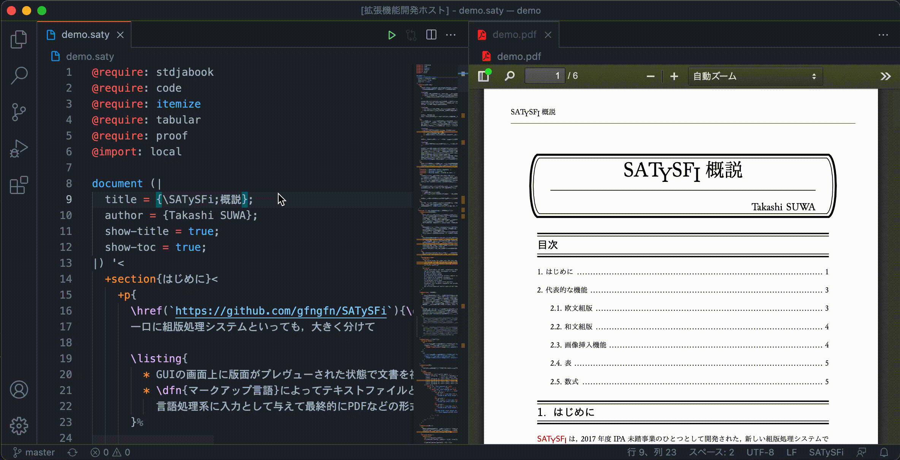
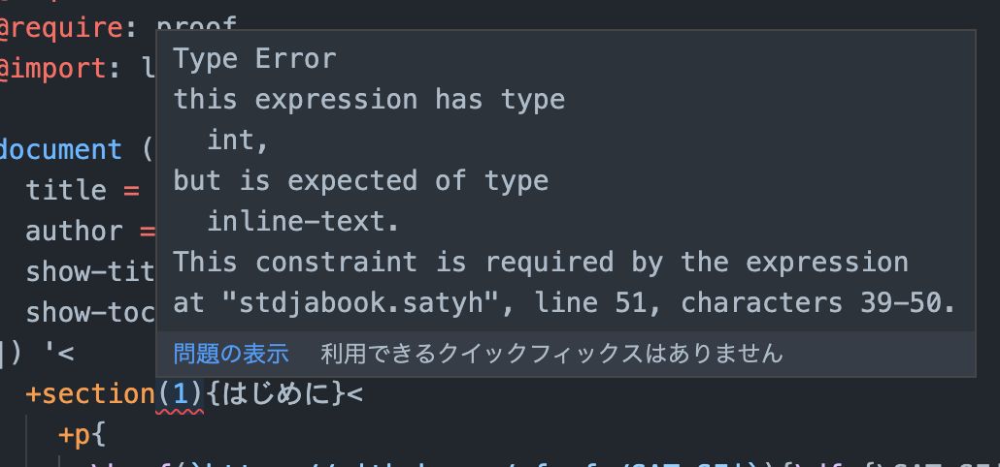
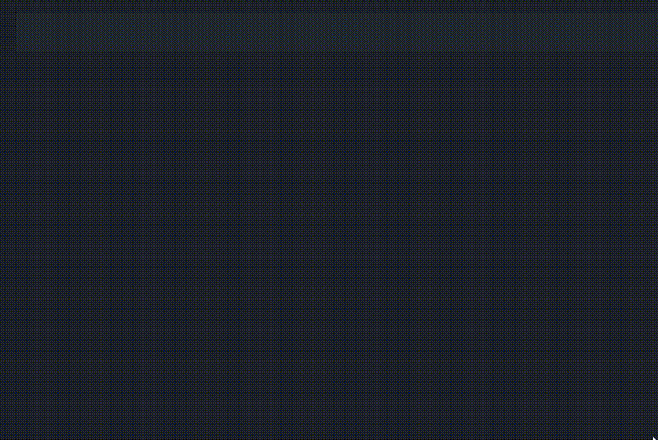
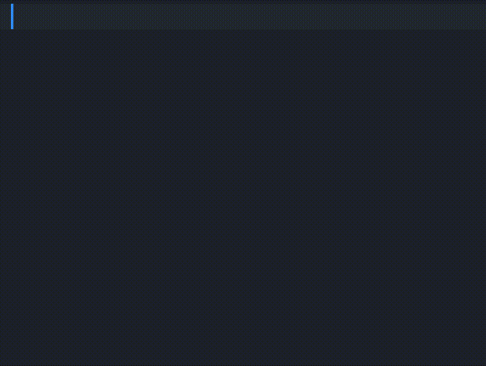

# SATySFi Workshop

[](https://github.com/pickoba/satysfi-workshop/actions/workflows/main.yml)
[](https://marketplace.visualstudio.com/items?itemName=pickoba.satysfi-workshop)

This extension provides language support for [SATySFi](https://github.com/gfngfn/SATySFi).

**Note:** This project is forked from wraikny/vscode-satysfi.

## Features

### Building



You can build your SATySFi documents from the button (top right) and keyboard shortcuts (ctrl/cmd + alt + b). You can also set it to build automatically when you save the file.

**Note:** This extension does not include a pdf viewer. If you need it, please install [vscode-pdf](https://marketplace.visualstudio.com/items?itemName=tomoki1207.pdf) or [LaTeX Workshop](https://marketplace.visualstudio.com/items?itemName=James-Yu.latex-workshop) etc.

### Type Checking



Type checking can be performed automatically when typing or saving a document.

### Package Completion



Package name completion based on SATySFi installation.

### Language Server Support



The language server provides completion and explanation of commands and variables.

This extension does not include the language server itself. You have to clone & build [monaqa/satysfi-language-server](https://github.com/monaqa/satysfi-language-server) on your own and configure as follows.

```json
{
  "satysfi-workshop.languageServer.enabled": true,
  "satysfi-workshop.languageServer.path": "/path/to/language server"
}
```

## Credits

I would like to express my gratitude to @wraikny, the original author of [vscode-satysfi](https://marketplace.visualstudio.com/items?itemName=wraikny.wraikny-satysfi-extension).

## License

Apache License 2.0, See [LICENSE](./LICENSE) for more information.
